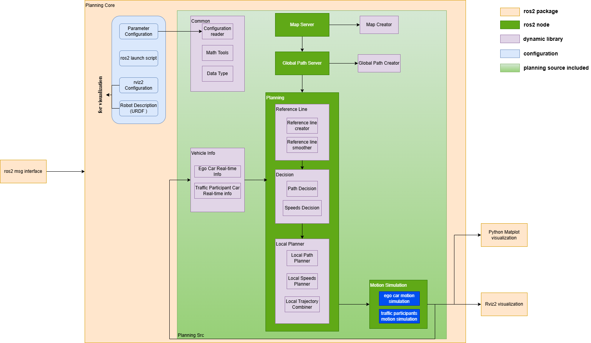
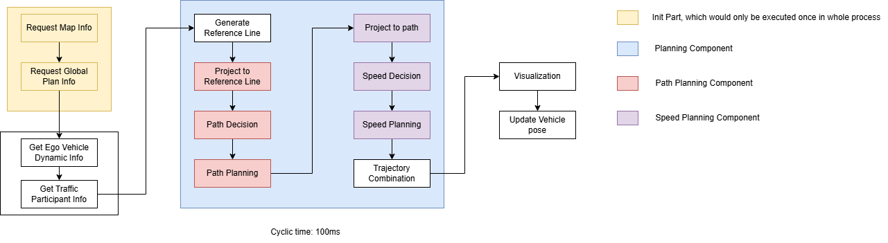

# BSAP ( Basic Situation Analysis & Planner)

Welcome to the BSAP repository! If you're passionate about robotics or ADAS technology, stick around — this project might be right up your alley.

## Project Overview

BSAP is a motion planning project built on top of **ROS 2**, designed for Advanced Driver Assistance Systems (ADAS) research and prototyping. The core of the project is a **Planning module** that follows the basic philosophy of the **EM Planner** — iteratively performing Expectation (path planning) and Maximization (speed planning) steps to generate safe and efficient trajectories.

In addition to the core planner, the project provides a set of supporting modules:

- **Decision Center** — situation analysis and behavioral decision making
- **Reference Line** — reference line generation and smoothing for Frenet-frame-based planning
- **Frenet–Cartesian Coordinate Conversion** — bidirectional transformation between Cartesian and Frenet states (including higher-order derivatives)
- **Motion Simulation** — ego vehicle and traffic participant move-command nodes for closed-loop simulation
- **Global Path Generator** — service-based global path planners (normal / A\* strategy pattern)
- **PNC Map Simulator** — map servers that produce lane-level PNC maps (straight road, S-turn, etc.)
- **Visualization** — an **RViz2** configuration for real-time 3-D visualization and a **matplotlib**-based data plotting package for post-analysis of planning results

---


## Required Platform

| Item | Requirement |
|------|-------------|
| ROS 2 | **Humble Hawksbill** |
| OS | Ubuntu **22.04** (recommended) |


## Architecture


*Figure: architecture diagram for BSAP*


*Figure: workflow diagram for BSAP*

---

## Dependencies

Before building the project, ensure you have the following dependencies installed:

- **Eigen 3.4.0**
- **osqp**
- **yaml-cpp**
- **matplotlib**

### Install Eigen 3.4.0

https://eigen.tuxfamily.org (recommended version: 3.4.0)

```sh
sudo mv eigen-3.4.0/ /usr/local/include/
```

### Install osqp

```sh
git clone https://github.com/oxfordcontrol/osqp.git
cd osqp
mkdir build
cd build
cmake ..
sudo make install
cd ../..
```

### Install yaml-cpp

```sh
git clone https://github.com/jbeder/yaml-cpp.git
cd yaml-cpp
mkdir build
cd build
cmake ..
sudo make install
cd ../..
```

### Install matplotlib

```sh
pip install matplotlib
```

## Getting Started

To get started with the project, follow these steps:

1. Clone the repository:
    ```sh
    git clone https://github.com/fanjj1994/BSAP.git
    ```
2. Navigate to the planning directory:
    ```sh
    cd <your-clone-path>/Planning
    ```
3. Build the project using ROS 2 Humble:
    ```sh
    source /opt/ros/humble/setup.bash
    colcon build
    ```
4. Launch the application (requires two launch files):
    ```sh
    chmod 777 scripts/start_launch.sh
    ./scripts/start_launch.sh
    ```
    - This script opens two terminals — one launches the planning nodes (PNC map server, global path server, planning process, RViz2) and the other launches the move-command simulation nodes (ego car & traffic participant).

---

## Contributing

Contributions are welcome! Every user in Github has read access. To get write access, please contact: [fanjj1994](https://github.com/fanjj1994) to add you to this repo that has write access. After that, you may need to know the following things:

### Branch & Contribution Policy

The main branch of this repository is **`development`**. Direct commits or force merge to `development` are **not** allowed. All changes must be submitted via **Pull Request** and require approval from reviewer **fanjj1994** before merging.

### Branch Naming Rule

All branches must be named with one of the following prefixes:

| Prefix | Purpose | Merge to `development` |
|--------|---------|:----------------------:|
| `feature/` | Develop a new feature (e.g., new global planner, new path planning method) | Yes |
| `bugfix/` | Fix an existing bug | Yes |
| `test/` | Add Google Test cases to verify functions | Yes |
| `doc/` | Add comments, Markdown documentation, or Doxygen to improve readability | Yes |
| `sandbox/` | Prototype / explore an idea for self-validation only | **No** |

**Examples:**

- Develop the decision module → `feature/Decision`
- Fix a uint8 overflow wrap-around bug → `bugfix/FixUint8DataOverflow`
- Add Doxygen comments for A\* global path planner → `doc/AStarComments`
- Explore replacing the simple map with a grid map → `sandbox/gridmap`

### Release Naming Rule

Release tags follow **Semantic Versioning**: `<major>.<minor>.<patch>`, e.g. `2.1.3` means major version 2, minor version 1, patch version 3.

Optionally, append `-pre` to indicate a **pre-release** version that may be unstable and requires further validation.

In addition, `release/` prefix before `<major>` is required in this project to indicate this is a release tag.

**Examples:**

- `release/1.0.0` — first stable release
- `release/1.4.2` — stable release with minor features and patches
- `release/2.0.0-pre` — pre-release of the next major version, not yet fully validated

### Clang-Format
All C++ source files (*.cpp, *.h, *.hpp, *.cc, *.cxx) in this project must comply with the .clang-format configuration at the repository root. A CI pipeline automatically checks formatting on every pull request — non-compliant code will fail the check and cannot be merged into development.

To format all C++ files locally before committing:
```sh
./scripts/format_all.sh
```

Note: Make sure the PLANNING_ROOT path inside format_all.sh matches your local workspace before running the script.

---

## Reference
 - ROS2 Humble Documentation: https://docs.ros.org/en/humble/index.html