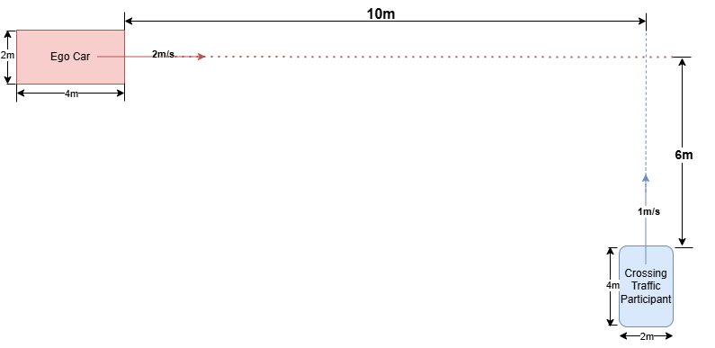
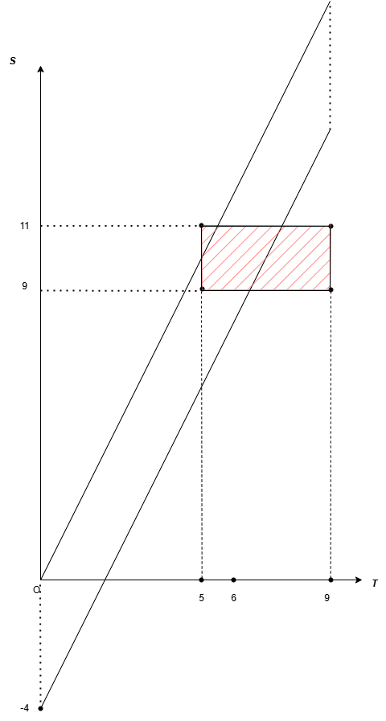
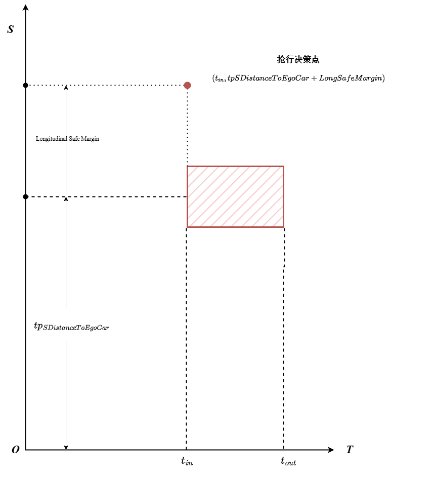
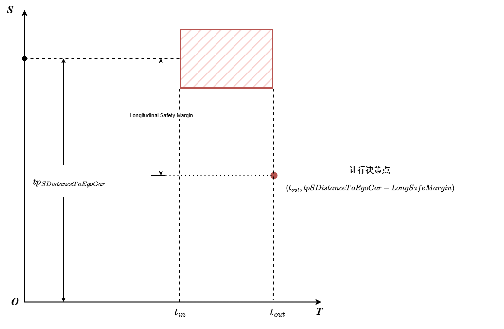

# 速度决策(Speed Decision Making)

本文档说明本项目中 `DecisionCenter` 如何基于已规划的局部路径上的障碍物信息，生成速度决策点(`STPoint`)，并与后端速度规划模块(`LocalSpeedsPlanner`)衔接。

> 说明：本文以工程实现为主，描述与代码保持一致；涉及的关键实现位于：
> - [DecisionCenter 头文件](../../src/planning_core/src/decision_center/decision_center.h)
> - [DecisionCenter 实现](../../src/planning_core/src/decision_center/decision_center.cpp)
> - [决策参数配置](../../src/planning_core/config/planning_static_tps_config.yaml)
> - [规划主流程](../../src/planning_core/src/planning_process/planning_process.cpp)
>
> 关于决策模块的背景与分类，见 [DecisionMaking.md](./DecisionMaking.md)；关于路径决策，见 [PathDecision.md](./PathDecision.md)。

---

## 1. 速度决策在系统中的位置(数据流)

速度决策是规划主流程的**第二个决策阶段**，发生在局部路径规划完成且障碍物已投影到局部路径坐标系之后：

1. 生成参考线(`ReferenceLineCreator`)。
2. 自车与 TP(Traffic Participant) 投影到参考线，获得全局 Frenet 状态(`getS()`, `getL()` 等)。
3. 路径决策(`DecisionCenter::makePathDecision()`)生成 `pathDecisionPoints`(左绕/右绕/停)。
4. 局部路径规划(`LocalPathPlanner::generateLocalPath()`)生成几何平滑的局部路径。
5. **TP 投影到局部路径**，获得路径坐标系下的状态(`getS2Path()`, `getL2Path()` 等)。
6. **速度决策**(`DecisionCenter::makeSpeedDecision()`)生成 `speedDecisionPoints`。
7. 速度规划(`LocalSpeedsPlanner::planLocalSpeeds()`)使用决策点规划速度曲线(QP 求解)。
8. 组合轨迹并发布(`LocalTrajectoryCombiner`)。

主要实现：[decision_center.cpp](../../src/planning_core/src/decision_center/decision_center.cpp)(调用入口：[planning_process.cpp](../../src/planning_core/src/planning_process/planning_process.cpp))

> **重要坐标系区分**：
> - 路径决策使用 TP 相对**参考线**的 Frenet 坐标(`getS()`, `getL()`)。
> - 速度决策使用 TP 相对**局部路径**的 Frenet 坐标(`getS2Path()`, `getL2Path()`)。
>
> 局部路径已包含路径决策产生的横向绕行偏移，因此路径坐标系下的横向偏移(`l_2path`)能更准确地反映 TP 对自车实际行驶通道的碰撞风险。

---

## 2. 关键概念：S-T图与决策点结构

### 2.1 S-T图(纵向位移—时间图)

S-T图是速度决策的核心分析工具，横轴为时间 $t$，纵轴为自车沿路径规划得到的局部路径的纵向位移 $s$(相对于路径起点)。下面举一个例子来说明S-T图的原理与画法。
#### 2.1.1 S-T 图示例：目标车辆自右向左横穿场景

以自车**前轴中心**为 $s$ 原点，假设自车以 2 m/s 的恒定速度向前做匀速直线运动，自车长度为 4 m，宽度为 2 m；在自车右前方有一辆目标车，目标车车头朝左（垂直于自车路径），以 1 m/s 的速度匀速自右向左横穿，目标车**前沿**（行进方向前缘）到自车前轴中心的横向距离为 6 m，目标车**中心**在 $s$ 轴上的纵向投影为 10 m，目标车长度（沿行进方向）为 4 m，宽度（垂直于行进方向）为 2 m，如图所示：


**为什么选自车侧边界而非路径中心线？**

S-T 图基于**路径-速度解耦**规划思路——自车沿已规划的固定路径行驶，只在纵向速度维度上规避冲突。对于横穿目标，我们关心"目标车何时实际接触自车车体"：

- **自右向左横穿**：目标车前沿先到达自车**右侧** bounding box（$l = -w_{ego}/2$），后沿最后离开，故以**自车右侧边界**为碰撞参考面；
- **自左向右横穿**：目标车前沿先到达自车**左侧** bounding box（$l = +w_{ego}/2$），对称地以**自车左侧边界**为碰撞参考面。

选取对应侧边界（而非路径中心线 $l=0$）才能准确反映目标车"实际碰到自车车体"的时间窗。

**$s$ 轴：目标车的纵向占据区间**

目标车垂直于路径横穿（车头朝左），其自身**车宽**（垂直于行进方向，2 m）决定它在 $s$ 轴上的占据范围——注意这里用的是**宽度**，因为车宽即为横穿车辆在路径纵向方向上的截面尺寸。以目标车纵向中心位置（10 m）为基准，向前/后各延伸 1 m：

$$s_{in} = s_{center} - \frac{w_{tp}}{2} = 10 - 1 = 9\,\text{m}, \quad s_{out} = s_{center} + \frac{w_{tp}}{2} = 10 + 1 = 11\,\text{m}$$

**$t$ 轴：目标车的时间冲突窗**

以自车右侧边界（$l = -w_{ego}/2 = -1$ m）为碰撞参考面，目标车横向速度 $v_l = 1$ m/s：

- **$t_{in}$（前沿到达右侧边界）**：目标车前沿（行进方向前缘）初始横向距自车中心 6 m，到达自车右侧边界需移动 $6 - 1 = 5$ m：

$$t_{in} = \frac{|l_{front}| - w_{ego}/2}{v_l} = \frac{6 - 1}{1} = 5\,\text{s}$$

- **$t_{out}$（后沿离开右侧边界）**：目标车后沿（行进方向末端）初始横向距自车中心 $|l_{front}| + L_{tp} = 6 + 4 = 10$ m，到达自车右侧边界需移动 $10 - 1 = 9$ m：

$$t_{out} = \frac{|l_{front}| + L_{tp} - w_{ego}/2}{v_l} = \frac{6 + 4 - 1}{1} = 9\,\text{s}$$

等价表达：$t_{out} = t_{in} + \dfrac{L_{tp}}{v_l} = 5 + \dfrac{4}{1} = 9\,\text{s}$

> **两个尺寸各司其职**：$s$ 轴占据宽度 $\Delta s = w_{tp} = 2$ m 由目标车的**车宽**（垂直于行进方向）决定；时间窗宽度 $\Delta t = L_{tp}/v_l = 4$ s 由目标车的**车长**（行进方向）决定。二者不可混淆。

目标车在 S-T 图上因此形成矩形阴影区域 $t \in [5,\ 9]$ s、$s \in [9,\ 11]$ m，如下图所示：



自车在 $t = 0$ 时纵向占据 $s \in [-4,\ 0]$ m；以 2 m/s 匀速前进，轨迹为斜率为 2 的直线；考虑到车身体积，轨迹实际扫过以 $(0,\ -4)$ 和 $(0,\ 0)$ 为起点、斜率为 2 的平行四边形区域。

若自车平行四边形与目标车矩形**有交集**，则存在碰撞风险；自车轨迹从阴影**上方**穿过 = 先行，从**下方**穿过 = 礼让。

**自左向右横穿的对称情形**

目标车从左侧向右横穿时（$l_{front} > 0$，$v_l$ 方向向右），以自车**左侧**边界（$l = +w_{ego}/2$）为碰撞参考面，公式完全对称：

$$t_{in} = \frac{l_{front} - w_{ego}/2}{|v_l|}, \quad t_{out} = t_{in} + \frac{L_{tp}}{|v_l|}$$

**与代码变量的对应关系（§5 分支 1b）**

代码基于 TP 中心到路径中线（$l = 0$）建模，以工程近似忽略自车侧边界偏移：

| 物理量 | 公式 | 代码变量 | 本例值 |
|--------|------|----------|--------|
| TP 中心纵向位置 | $s_{center}$ | 由 `getS2Path()` 获取 | 10 m |
| TP 中心到路径中线时间 | $(0 - l_{center})\ /\ \|dl\_dt\|$ | `tpToPathTime` | $(0-(-8))/1 = 8$ s |
| TP 半宽穿越时间 | $(w_{tp}/2)\ /\ \|dl\_dt\|$ | `timeToCrossHalfWidthOfTp` | $(2/2)/1 = 1$ s |
| 冲突窗开始（代码近似） | $\text{tpToPathTime} - \text{timeToCrossHalfWidthOfTp}$ | `p.t_in` | $8 - 1 = 7$ s |
| 冲突窗结束（代码近似） | $\text{tpToPathTime} + \text{timeToCrossHalfWidthOfTp}$ | `p.t_out` | $8 + 1 = 9$ s |
| 自车到达 TP 纵向位置的时间 | $s_{center}\ /\ v_{set}$ | `egoCarToTpSTimeUsingSetSpeed` | $10/2 = 5$ s |

> 本例 TP 中心横向位置 $l_{center} = -(|l_{front}| + L_{tp}/2) = -(6+2) = -8$ m。代码与物理模型存在两处数值差异（代码 $t_{in}=7$ s vs 物理 $t_{in}=5$ s）：① 代码以路径**中心线**为基准，未扣除自车半宽（差 1 s）；② 代码以目标车**车宽**（2 m）推算时间窗，而非横穿方向上的**车长**（4 m），导致时间窗偏窄（差 1 s）。两处近似均使代码结果偏保守。

#### 2.1.2 代码模型：自车质心近似与抢行/让行决策点选取

§2.1.1 中以平行四边形表示自车体积扫过的区域，属于精确物理模型。代码在工程实现中对自车做了进一步简化——将自车视为**质心点**，不考虑碰撞体积。在此假设下，自车在 S-T 图上退化为一条过原点、斜率为目标速度 $v_{set}$ 的直线：

$$s_{ego}(t) = v_{set} \cdot t$$

**抢行/让行的几何判据**

以目标车中心在 S-T 图中的位置点 $\bigl(\,t_{center},\ s_{center}\bigr)$（对应代码变量 `tpToPathTime`、`tpSDistanceToEgoCar`）与自车直线的相对关系作为判断依据：

- 目标车中心在自车直线**上方或线上**（$s_{center} \geq v_{set}\cdot t_{center}$）：自车沿当前速度到达目标车纵向位置时，目标车已在路径上（或恰好到达）——存在碰撞风险，需**让行（YIELD）**;

- 目标车中心在自车直线**下方**（$s_{center} < v_{set}\cdot t_{center}$）：自车将在目标车到达路径之前通过——可**抢行（ASSERTIVE DRIVE）**。

等价的代码判断条件（见 §5 分支 1b）：

$$\frac{s_{center}}{v_{set}} \gtrless t_{center} \quad\Longleftrightarrow\quad \texttt{egoCarToTpSTimeUsingSetSpeed} \gtrless \texttt{tpToPathTime}$$

以 §2.1.1 的例子代入代码变量值（$v_{set} = 2$ m/s，$t_{center} = \texttt{tpToPathTime} = 8$ s，$s_{center} = \texttt{tpSDistanceToEgoCar} = 10$ m）：

$$s_{ego}(8) = 2 \times 8 = 16\,\text{m} \quad > \quad s_{center} = 10\,\text{m}$$

目标车中心在自车直线**下方** → **抢行**（等价地：$\texttt{egoCarToTpSTimeUsingSetSpeed} = 5\,\text{s} < \texttt{tpToPathTime} = 8\,\text{s}$）。

**决策点的几何含义与 `long_safe_margin_`**

一旦方向确定，代码以 `tpSDistanceToEgoCar`（目标车中心纵向位置）为基准，配合 `long_safe_margin_` 施加安全偏置，确定传给 QP 的约束锚点 $(t,\ s)$：

| 决策类型 | 锚点时刻 $t$ | 锚点纵向位置 $s$ | 几何含义 |
|----------|-------------|-----------------|----------|
| **ASSERTIVE DRIVE** | $t_{in}$ | $s_{center} + \texttt{long\_safe\_margin\_}$ | 目标车前沿到达路径时，自车已领先目标车中心至少 `long_safe_margin_` |
| **YIELD** | $t_{out}$ | $s_{center} - \texttt{long\_safe\_margin\_}$ | 目标车后沿离开路径时，自车仍落后目标车中心至少 `long_safe_margin_` |



继续以 §2.1.1 的例子，设 `long_safe_margin_ = 2 m`（$t_{in} = 7$ s，$t_{out} = 9$ s，$s_{center} = 10$ m）：

- **抢行决策点**（本例适用）：$(7,\ 12)$——QP 约束自车在第 7 s 时达到 $s = 12$ m，确保在目标车前沿进入路径前已安全通过；
- **（假设让行）让行决策点**：$(9,\ 8)$——QP 约束自车在第 9 s 时仅到达 $s = 8$ m，等待目标车完全离开路径后再通行。

> **安全裕量的分工**：`long_safe_margin_` 在**空间维度**提供安全缓冲；$[t_{in},\ t_{out}]$ 冲突时间窗在**时间维度**覆盖目标车的占路区间。两个维度的安全考量正交独立，互不耦合。

### 2.2 STPoint 结构

[`STPoint`](../../src/planning_core/src/decision_center/decision_center.h) 是速度决策的输出基本单元，向下游 QP 速度规划器同时传递几何约束(位置与速度)和逻辑约束(驾驶意图)：

| 字段 | 类型 | 含义 |
|------|------|------|
| `t` | `float64` | 决策锚点在 S-T 图中的时间坐标 |
| `s_2path` | `float64` | 锚点时刻自车的目标纵向位移(相对速度规划窗口起点) |
| `ds_dt_2path` | `float64` | 锚点处的参考速度，为 QP 提供一阶导数目标 |
| `t0` | `float64` | 该 TP 被纳入决策时的追踪时间累计值(S-T 轨迹线的**时间锚点**) |
| `s0` | `float64` | `t0` 时刻 TP 在速度规划坐标系下的纵向位置(S-T 轨迹线的**空间锚点**)|
| `t_in` | `float64` | TP 阴影进入路径截面的时刻(冲突窗开始) |
| `t_out` | `float64` | TP 阴影离开路径截面的时刻(冲突窗结束) |
| `type` | `STPointType` | 决策语义标签，锁定 QP 的同伦类 |
| `speed_limit` | `float64` | 该点起的速度上限(预留字段，当前未使用) |

`t0` 与 `s0` 共同定义了 TP 在 S-T 图中的运动直线：$s(t) = s_0 + \dot{s}_{tp}(t - t_0)$，供 QP 构建约束时使用。

### 2.3 STPointType 枚举

| 枚举值 | 语义 | QP 约束方向 |
|--------|------|-------------|
| `DECISION_STOP_OR_FOLLOW` | 跟车或跟停 |自车轨迹须保持在 TP 安全距离之后(S-T 图**下方**约束，持续至规划窗口末尾) |
| `DECISION_YIELD` | 礼让 |自车轨迹须从 TP 阴影**下方**通过(减速等待至 `t_out` 后再通行) |
| `DECISION_ASSERTIVE_DRIVE` | 强行先行 |自车轨迹须从 TP 阴影**上方**通过(在 `t_in` 前保持速度先行通过) |
| `DECISION_START` | 决策区间起点 | 标记速度约束区间开始，QP 从此处切入约束 |
| `DECISION_END` | 决策区间终点 | 标记速度约束区间结束，QP 在此之后恢复自由巡航引导 |

---

## 3. 输入/输出定义

### 输入

`DecisionCenter::makeSpeedDecision(egoCarInfo, tpInfoList)`：

- `egoCarInfo`：自车当前状态(实时速度 `getDsDt()`、车辆尺寸)。
- `tpInfoList`：已完成局部路径投影的交通参与者列表，每个 TP 提供：
  - `getS2Path()`：TP 在局部路径上的纵向投影(相对路径起点)；
  - `getL2Path()`：TP 相对局部路径的横向偏移；
  - `getDsDt2Path()`：TP 沿局部路径方向的纵向速度；
  - `getDlDt2Path()`：TP 相对局部路径的横向速度；
  - `getVehicleWidth()`：TP 车辆宽度。
- 配置参数(由 `ConfigReader` 从 YAML 加载)：
  - `egoCar.set_speed_`：配置的目标/设定速度，用于计算决策水平线与时间估算；
  - `localSpeeds.speeds_size_`：速度规划前瞻帧数，用于推导 `decisionMakingLeadFrame`；
  - `localSpeeds.speed_size_`：速度规划窗口总帧数；
  - `decision.long_safe_margin_`：纵向安全距离。

### 输出

输出为内部成员 `speedDecisionPoints`(`std::vector<STPoint>`)，通过 `getSpeedDecisionPoints()` 供下游 `LocalSpeedsPlanner` 读取。

每个规划周期至多产生**一个核心决策点**(第一个满足条件的 TP 触发后即 `break`)，加上首尾帧(DECISION_START 与可选的 DECISION_END)，因此输出序列结构为：

```
[DECISION_START] → [STOP_OR_FOLLOW | YIELD | ASSERTIVE_DRIVE] → [DECISION_END(非STOP_OR_FOLLOW时)]
```

---

## 4. 决策参数说明

`makeSpeedDecision()` 开头计算三个核心参数：

### `decisionMakingLeadFrame`

```
decisionMakingLeadFrame = clamp(speeds_size_ - 50, 40, 50)
```

速度规划窗口前端的**缓冲帧数**，取值钳制在 `[40, 50]`。类比路径决策中的 `decisionMakingLeadPoint`(路径点数前瞻)，这里是在时间轴上的前瞻量，用于推导决策水平线和 `SimpleTTB`。

### `decisionMakingLeastDistance`

```
decisionMakingLeastDistance = decisionMakingLeadFrame × set_speed_
```

速度决策的**纵向过滤阈值**：TP 纵向距离超过此值则过远，不纳入本周期决策。只有当TP距离自车的纵向距离小于或等于此阈值才会开始考虑这个障碍物。使用配置的恒定目标速度(而非实时自车速度)，保证决策水平线稳定，不因自车速度波动而抖动。

> 对比：路径决策的纵向水平线 `max(ego_dsDt × leadPoint, DMMINLENGTH)` 会随自车实时速度变化；速度决策使用固定的 `set_speed_`，决策范围更稳定。

### `SimpleTTB`(Simple Time To Brake)

```
SimpleTTB = (speed_size_ + decisionMakingLeadFrame) / 2
```

用于处理跟车或停车场景。速度规划窗口总帧数与前瞻帧数的平均值，用于确定 `DECISION_STOP_OR_FOLLOW` 的t坐标;在这之后自车实现跟车或停车操作。取中间时刻作为代表性决策点，既避免因近端不确定性导致的抖动，也避免因选取末端带来的响应延迟。

---

## 5. 决策逻辑详解

`makeSpeedDecision()` 的核心是对 TP 列表进行**分层过滤与分支决策**，第一个满足条件的 TP 触发决策后立即 `break`，后续 TP 忽略。

### Step 0：空输入检查

若 `tpInfoList` 为空，直接返回，不产生速度决策点。

### Step 1：清理上一周期决策

调用 `speedDecisionInitialize()` 清空 `speedDecisionPoints`，避免历史决策污染当前周期。

### Step 2：初始化决策参数

计算 `decisionMakingLeadFrame`、`decisionMakingLeastDistance`、`SimpleTTB`(见第 4 节)。

### Step 3：纵向距离修正

对每个 TP 计算修正后的自车到 TP 的真实纵向距离：

```
tpSDistanceToEgoCar = tp.getS2Path() + ego.getDsDt()
```

`getS2Path()` 返回 TP 相对**路径起点**的纵向位置，而路径起点在自车当前位置前方一帧的纵向行程处(路径起点 = ego_s + ds_dt)，因此需要加上自车一帧的纵向行程进行补偿，还原出真实的自车到 TP 距离。

### Step 4：纵向范围过滤

```
若 tpSDistanceToEgoCar > decisionMakingLeastDistance → 过远，跳过
若 tpSDistanceToEgoCar < -long_safe_margin_             → 已超过自车并留有安全裕量，跳过
```

后向边界使用 `long_safe_margin_`(而非零)作为裕量，可防止 TP 恰好位于自车后方附近时决策在"礼让"和"停车"之间反复震荡。

### Step 5：横向占据检查(进入分支)

```
若 |tp.getL2Path()| < tp.width / 2 → TP 当前横向上已与路径截面重叠
```

只有当前在横向上与路径重叠的 TP 才进入后续决策。

---

### 分支 1a：TP 横向静止且已在路径上

**触发条件：** `|tp.getDlDt2Path()| < MINSPEED`(横向速度近零，TP 纵向行驶或停在路径上)

**跳过条件：** 若 `tp.getDsDt2Path() > ego.getDsDt() + SPEEDMARGIN`，TP 正在快速远离自车，无碰撞风险，跳过。

**否则 → 决策 STOP_OR_FOLLOW(跟停/跟车)：**

TP 在整个规划窗口内持续占据路径(无法借助自身横向运动清路)，自车必须跟随或停止。

**决策步骤：**

1. **记录 ST 轨迹锚点(跨周期追踪)：**
   - `tpInfo->updateT0()`：累计该 TP 被追踪的帧数(跨规划周期持续增加，直到 TP 离开视野)；
   - `p.t0 = tpInfo->getT0()`：读取当前追踪时长作为时间锚点；
   - `p.s0 = tpSDistanceToEgoCar + ds_dt_tp × t0 - decisionMakingLeastDistance`：将 TP 当前位置加上其在 `t0` 内的纵向行进量，再转换到速度规划坐标系，定义 ST 轨迹直线的参考点。

2. **设置冲突时间窗：**
   - `p.t_in = 0`(TP 已在路径上，冲突立即开始)；
   - `p.t_out = speed_size_`(约束持续到规划窗口末尾，TP 不会在本窗口内横向离开路径)。

3. **放置 ST 决策顶点(QP 约束参考点)：**
   - 时刻：`p.t = t0 + SimpleTTB`(追踪起点加上规划窗口中间时长，作为代表性目标点)；
   - 位置：`p.s_2path = tpSDistanceToEgoCar - long_safe_margin_ + ds_dt_tp × p.t`
     (自车应保持在 TP 后方 `long_safe_margin_` 处，并与 TP 同步前移)；
   - 参考速度：`p.ds_dt_2path = ds_dt_tp`(自车速度目标跟随 TP。`ds_dt_tp ≈ 0` 时等价于停车；`ds_dt_tp > 0` 时等价于跟车随行)。

4. 将决策点推入 `speedDecisionPoints`，然后 `break`。

---

### 分支 1b：TP 横向运动且即将穿越路径

**触发条件：** `|tp.getDlDt2Path()| ≥ MINSPEED`(TP 有横向运动，正在穿越或远离路径)

**跳过条件：** 若配置目标速度 `set_speed_` 近零，时间估算无意义，跳过。

**时间估算：**

- `egoCarToTpSTimeUsingSetSpeed = tpSDistanceToEgoCar / set_speed_`
 自车以目标速度行驶到达 TP 当前纵向位置所需时间；
- `tpToPathTime = (0 - tp.l2path) / tp.dl_dt_2path`
  TP 横向中心到达路径中心线(`l = 0`)所需时间。

若 `tpToPathTime < 0`，TP 正在横向**远离**路径，无碰撞风险，跳过。

**构造冲突时间窗 $[t_{in}, t_{out}]$：**

考虑障碍物有限宽度与自车纵向安全距离的时间等价量：

- `timeToCrossHalfWidthOfTp = (tp.width / 2) / |tp.dl_dt_2path|`
  TP 横向移动半个车宽所需时间(用于将障碍物的有限宽度转换为时间窗扩展量)；
- `p.t_in = tpToPathTime - timeToCrossHalfWidthOfTp`(TP 前缘到达路径的时刻)；
- `p.t_out = tpToPathTime + timeToCrossHalfWidthOfTp`(TP 后缘离开路径的时刻)；
- `deltaT = long_safe_margin_ / set_speed_`(纵向安全距离折算的安全时间裕量，用于扩大决策边界，避免"刚好擦过"的危险情况)。

**三种情况的决策判断：**

#### YIELD(礼让)

**条件：** `egoCarToTpSTimeUsingSetSpeed > tpToPathTime` 且 `egoCarToTpSTimeUsingSetSpeed < t_out + deltaT`

含义：自车到达 TP 纵向位置时，TP 正在路径上(或刚刚经过)，且时间差在安全裕量之内——若维持速度冲过去有碰撞风险，需要减速等待 TP 清路。

决策：
- `p.t = t_out`(TP 完全离开路径的时刻，即最早可安全通行的时刻)；
- `p.s_2path = tpSDistanceToEgoCar - long_safe_margin_`(自车在 `t_out` 时刻的目标位置：停在 TP 当前纵向位置后方 `long_safe_margin_` 处等待)；
- `p.ds_dt_2path = set_speed_`(礼让后恢复目标速度)；
- `p.type = DECISION_YIELD`；
- `break`。

#### ASSERTIVE DRIVE(强行先行)

**条件：** `egoCarToTpSTimeUsingSetSpeed < tpToPathTime` 且 `egoCarToTpSTimeUsingSetSpeed > t_in - deltaT`

含义：自车在TP进入路径**之前**到达，但时间差在安全裕量之内——若能维持速度通过，可以在 TP 前缘进入路径之前安全清场。

决策：
- `p.t = t_in`(TP 前缘进入路径的时刻，即自车必须在此之前通过)；
- `p.s_2path = tpSDistanceToEgoCar + long_safe_margin_`(自车在 `t_in` 时刻已通过 TP 位置并留有安全距离)；
- `p.ds_dt_2path = set_speed_`(维持目标速度)；
- `p.type = DECISION_ASSERTIVE_DRIVE`；
- `break`。

#### 无冲突风险

自车到达时间远在 TP 占路窗口之外(超出安全裕量范围)，继续处理下一 TP。

---

### Step 6：决策后处理 — START/END 拼接

若循环结束后 `speedDecisionPoints` 为空，说明无需速度约束，返回。

**前插 DECISION_START：**
- `pStart.t = front.t0`(TP 追踪起始时刻)；
- `pStart.s_2path = front.s0`(TP ST 轨迹线的参考原点对应的自车位置)；
- `pStart.ds_dt_2path = set_speed_`(以目标速度进入约束区间)；
- 作用：为 QP 提供约束区间的起始引导点，实现从自由巡航到约束区间的平滑切入。

**尾追 DECISION_END(仅 YIELD 和 ASSERTIVE_DRIVE)：**
- `pEnd.t = speed_size_`(规划窗口末尾)；
- `pEnd.s_2path`：由最后一个决策点以 `set_speed_` 线性外推至窗口末尾；
- `pEnd.ds_dt_2path = set_speed_`；
- 作用：约束区间结束后，QP 恢复自由巡航引导。

> `DECISION_STOP_OR_FOLLOW` 不追加 `DECISION_END`，因为其约束持续到窗口末尾(`t_out = speed_size_`)，不存在"恢复自由"的时刻。这与路径决策中 `DECISION_STOP` 不追加 `DECISION_END` 的逻辑完全对称。

---

## 6. 典型场景示例

### 场景 A：前方低速/静止障碍物(STOP_OR_FOLLOW)

**场景描述：** 路径决策已判定路径前方有一辆车无法绕行(输出 `DECISION_STOP`)。速度决策需在时间域约束自车速度，使其减速并停在该车安全距离之外——或若该车缓慢行驶则跟随其速度。

**关键特征：**
- TP：`|l_2path| < width/2`(横向占据路径)，`|dl_dt_2path| ≈ 0`(横向静止)，`ds_dt_2path < ego_speed + SPEEDMARGIN`(未快速远离)。

**输出 STPoint 序列：**
1. `DECISION_START (t=t0, s=s0, ds/dt=set_speed)`
2. `DECISION_STOP_OR_FOLLOW (t=t0+SimpleTTB, s=距离-long_safe_margin_+ds×t, ds/dt=ds_dt_tp)`

若 `ds_dt_tp ≈ 0`，QP 将约束自车速度曲线在中间时刻降至 0 并保持(停车)；若 `ds_dt_tp > 0`，QP 约束自车以 TP 速度跟车行驶(跟车随行)。

---

### 场景 B：行人从侧方穿越路径(YIELD)

**场景描述：** 一名行人从路径右侧向左移动，将在某时刻经过路径中心。路径决策未对其产生决策(行人不在全局参考线内，但在局部路径坐标系中 `|l_2path| < width/2`)。自车若不减速将在行人穿越窗口内到达行人位置。

**关键特征：**
- `l_2path < 0`(行人在路径右侧)，`dl_dt_2path > 0`(向路径中心移动)，`tpToPathTime > 0`；
- `egoCarToTpSTimeUsingSetSpeed > tpToPathTime`(自车到达时行人已在路径上)，且差值在安全裕量内。

**输出 STPoint 序列：**
1. `DECISION_START (t=t0, s=s0, ds/dt=set_speed)`
2. `DECISION_YIELD (t=t_out, s=距离-long_safe_margin_, ds/dt=set_speed)`
3. `DECISION_END (t=speed_size_, s=外推位置, ds/dt=set_speed)`

QP 约束：速度曲线须在 `t_out` 之前保持在行人阴影下方(减速等待)，`t_out` 之后恢复巡航。

---

### 场景 C：行人从侧方穿越路径(ASSERTIVE DRIVE)

**场景描述：** 同场景 B，但行人速度更慢，自车以目标速度行驶时会在行人到达路径中心**之前**通过其前方。

**关键特征：**
- `egoCarToTpSTimeUsingSetSpeed < tpToPathTime`(自车比行人先到)，且差值在安全裕量内。

**输出 STPoint 序列：**
1. `DECISION_START (t=t0, s=s0, ds/dt=set_speed)`
2. `DECISION_ASSERTIVE_DRIVE (t=t_in, s=距离+long_safe_margin_, ds/dt=set_speed)`
3. `DECISION_END (t=speed_size_, s=外推位置, ds/dt=set_speed)`

QP 约束：速度曲线须在 `t_in` 之前保持在行人阴影上方(维持速度先行)，确保在行人进入路径前完成通过。

---

## 7. 当前实现的边界与后续扩展方向

1. **路径决策与速度决策的隐式耦合**：分支 1a(STOP_OR_FOLLOW)的正确触发依赖路径决策已将该 TP 判定为"不可绕行"，二者之间没有显式互锁机制，依赖规划主流程的调用顺序保证逻辑一致性。

2. **横向穿越 TP 的纵向速度未纳入冲突窗计算**：分支 1b 中，`tpToPathTime` 仅基于横向速度计算，TP 自身的纵向速度(`getDsDt2Path()`)对冲突窗的影响未被考虑，对于高速斜切进入路径的障碍物计算可能不够精确。

3. **多 TP 场景仅取"最近优先"**：循环遇到第一个满足条件的 TP 即 `break`，较远 TP 的速度约束被完全忽略。

4. **横向运动建模为等速直线**：`tpToPathTime` 基于等速横向运动假设，不考虑行人/车辆横向加减速，后续可引入预测模型提升精度。

5. **`speed_limit` 字段预留未实现**：`STPoint::speed_limit` 尚未赋值，限速场景的速度约束尚未接入速度决策。
