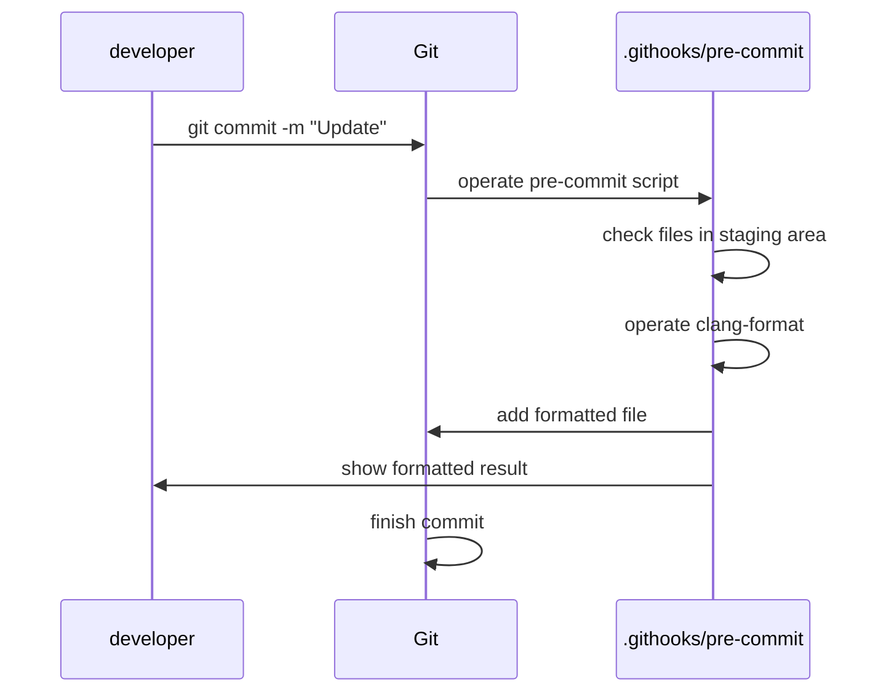

```mermaid
sequenceDiagram
    participant Dev as developer
    participant Git as Git
    participant Hook as .githooks/pre-commit
    
    Dev->>Git: git commit -m "Update"
    Git->>Hook: operate pre-commit script
    Hook->>Hook: check files in staging area
    Hook->>Hook: operate clang-format
    Hook->>Git: add formatted file
    Hook->>Dev: show formatted result
    Git->>Git: finish commit
```